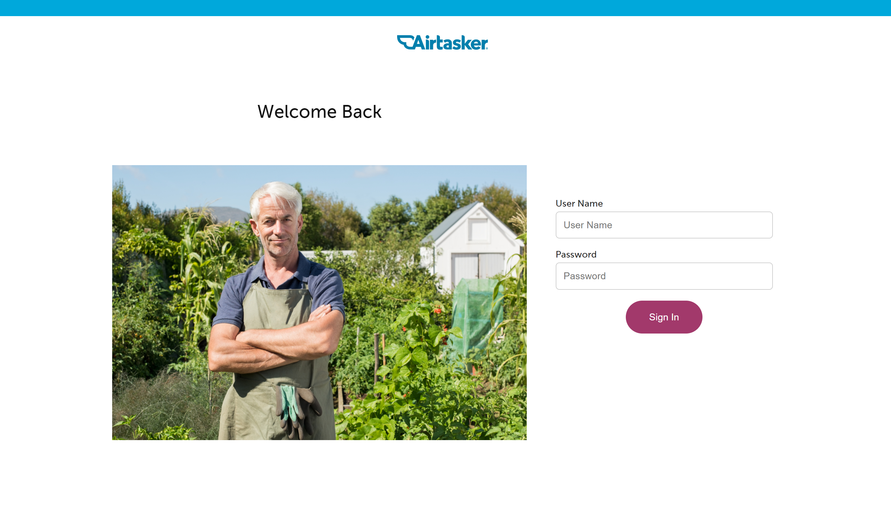
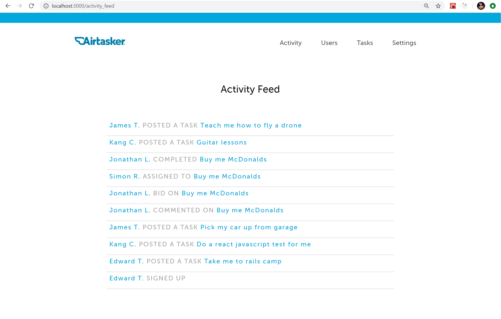
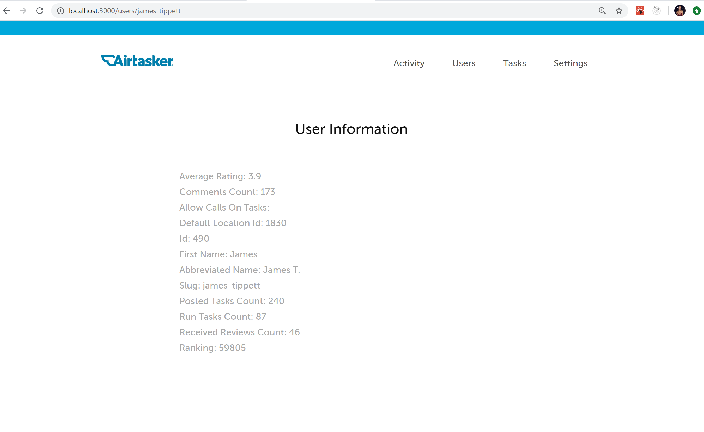
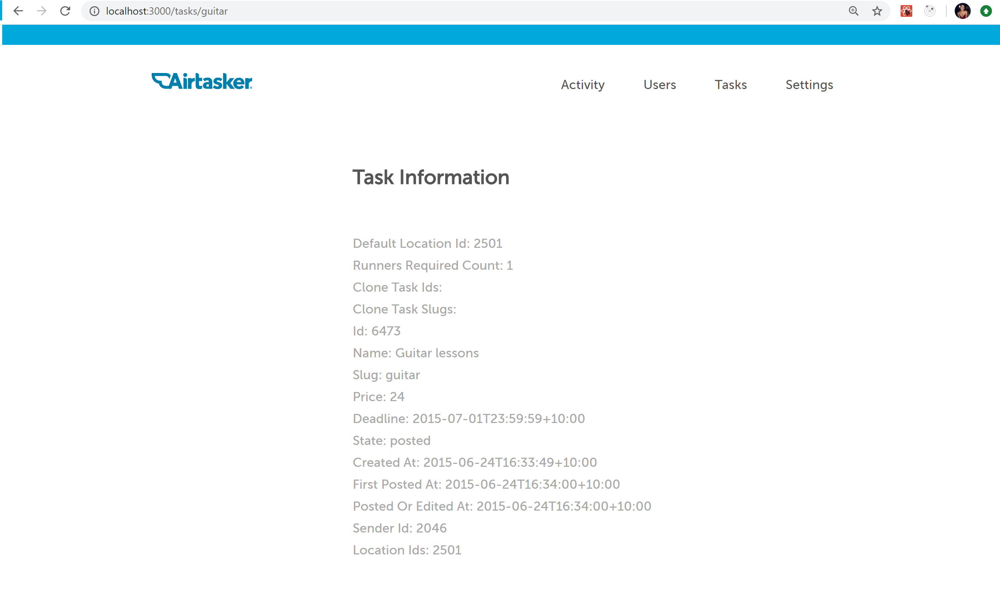
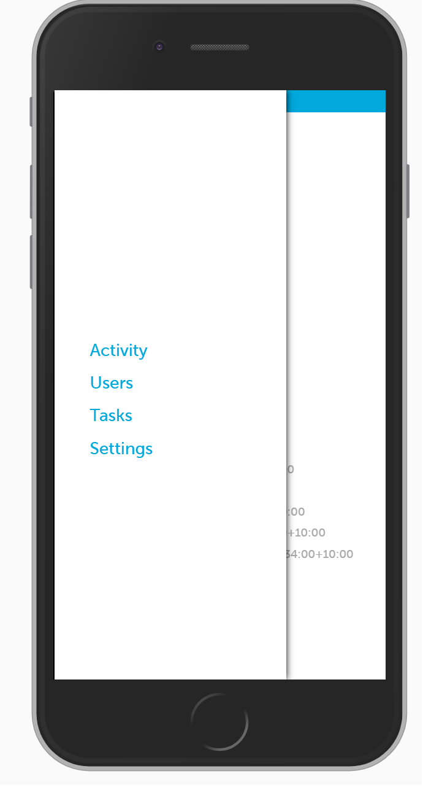
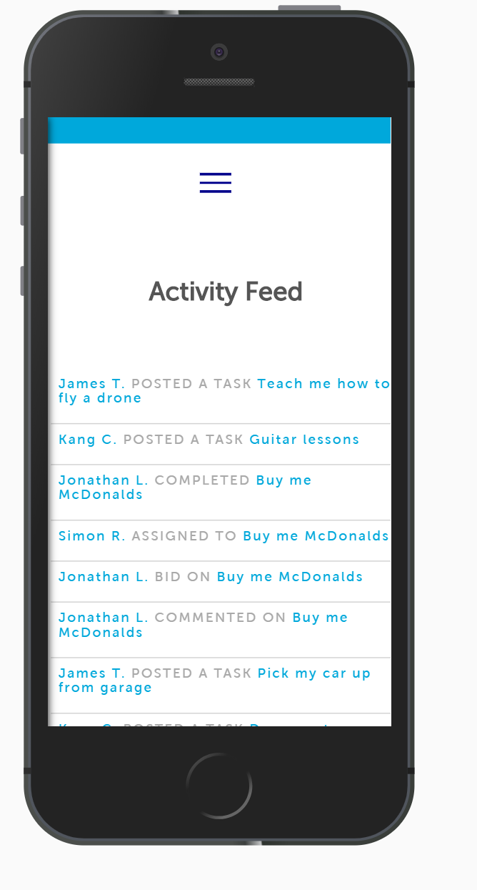

# Airtasker

### Front End

### Challenge Idea: 
Based on images given I designed a platform that provides organised structure information for Airtasker administrators to access its users and tasks

### Design

### Design Considerations
* UI Colours Font-family: MUSEO SANS 500
* Airtasker UI Colours: #00A8DB, #A2396B and #F4BE36
* Mobile Friendly

### Built with:
* React.js - JavaScript Framework
* CSS3 - Styling
* VSCode - Text Editor

